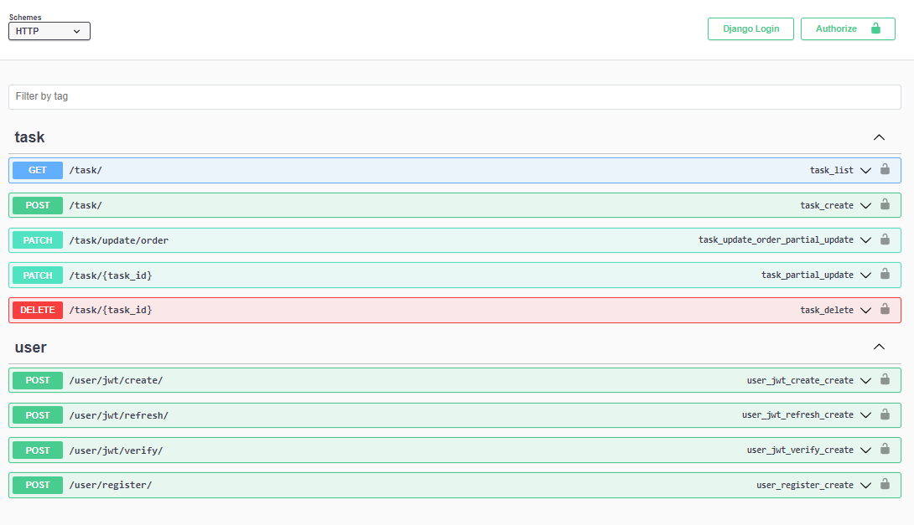

# Draggable Post-it style To-Do App

## Vue 3 and Django REST Framework

---

### Demo

https://django.stickydo.us

### Frontend - Vue-3 (Composition API Script Setup)

<ul>
    <li>
        
Latest Vue 3 <strong>Composition API</strong> Script Setup

    </li>
    <li>
        
<strong>Drag and drop</strong> functionality to change priority of tasks thanks to <a href="https://github.com/SortableJS/vue.draggable.next">Vue Draggable Next</a>

    </li>
    <li>
        
Date picker implemented using <a href="https://github.com/Vuepic/vue-datepicker">Vue Datepicker</a>

    </li>
    <li>
        
<strong>Pinia</strong> for state/store management

    </li>
    <li>
        
<strong>Axios</strong> for making HTTP Requests, including advanced interceptors usage to <strong>refresh</strong> JWT tokens

    </li>
</ul>

### Backend - Django 4 and DRF

<ul>
    <li>
        
Django 4 and Django REST Framework

    <li>
        
JWT refresh and access tokens for Authentication

    </li>
    <li>
        
Users may login using <strong>email</strong> or <strong>username</strong>

    </li>
    <li>
        
Automatic Open API/Swagger generation with <strong>drf-yasg</strong> Available <a href="https://notarious.pythonanywhere.com/docs/">Online</a>

    </li>
    <li>
        
<strong>100%</strong> Unit Test coverage of models, urls, views and APIs, including JWT APIs

    </li>
    <li>
        
<strong>Github actions</strong> to run Unit Tests and Linting (with Black)

    </li>
</ul>

